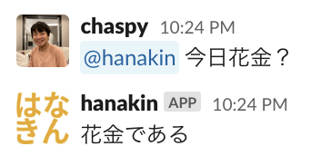
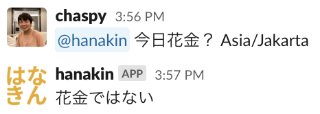

# slack-hanakin-bot

[](https://github.com/chaspy/slack-hanakin-bot/actions/workflows/test.yaml)



Illustrated by [@shimiwaka](https://github.com/shimiwaka)

## Feature

Depending on the day of the week, the bot will reply whether today is Hanakin ([花金](https://kotobank.jp/word/%E8%8A%B1%E9%87%91-603416)).


### Support Timezone

The bot can reply whether or not it is Hanakin in the specified timezone. The timezone is specified in the second argument. 



The default value can be set by `env.timezone` .

## Development

### Work on new Slack platform

This bot will work on [new Slack platform](https://api.slack.com/future?utm_medium=referral&utm_source=partner&utm_campaign=fy23-dev-open-beta-launch) powered by [Deno](https://deno.com/blog/slack-open-beta)

### Local development

```
cp env.ts.sample env.ts
# edit env.ts
slack run
```

### Deploy

```
slack deploy
```

