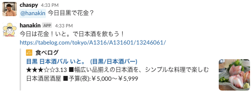

# hanakintaro (slack-hanakin-bot)

[](https://github.com/chaspy/hanakintaro/actions/workflows/test.yaml)


Illustrated by [@shimiwaka](https://github.com/shimiwaka)

## Feature

Depending on the day of the week, the bot will reply whether today is Hanakin ([花金](https://kotobank.jp/word/%E8%8A%B1%E9%87%91-603416)).


### Timezone Support

The bot can reply whether or not it is Hanakin in the specified timezone. The timezone is specified in the second argument. 


The default value can be set by `env.timezone` .

### Suggest Recommended Place

The bot will reply a recommended place for drinking. The data source is [env.ts](https://github.com/chaspy/hanakintaro/blob/main/env.ts)



## Development

### Work on new Slack platform

This bot will work on [new Slack platform](https://api.slack.com/future?utm_medium=referral&utm_source=partner&utm_campaign=fy23-dev-open-beta-launch) powered by [Deno](https://deno.com/blog/slack-open-beta)

### Local development

```
slack run
```

### Setup environment variable

```
slack env add channel_id ABCDEFGHI
```

### Test

```
deno test
```

### Deploy

```
slack deploy
```

